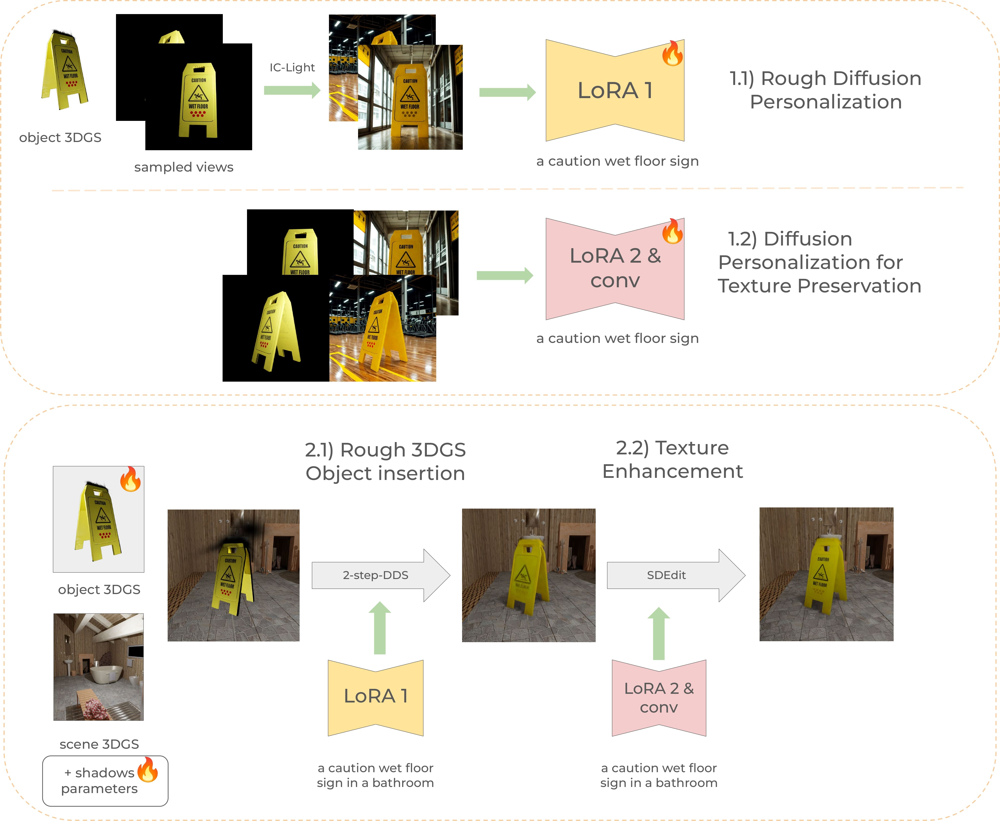
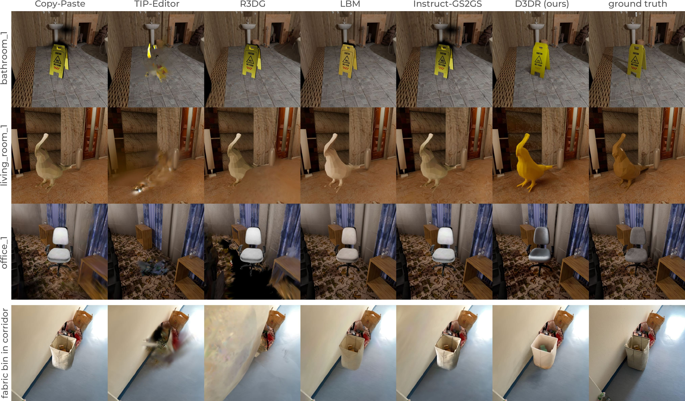

# D3DR: Diffusion Models are Secretly Zero-Shot 3DGS Harmonizers

> TL;DR: D3DR inserts a 3DGS object into a 3DGS scene and harmonizes appearance and shadows using diffusion models.

## Project Page | [ArXiv](https://arxiv.org/abs/2503.06740) | [Dataset](https://zenodo.org/records/19220048)

<p align="center">
  
</p>

[`Vsevolod Skorokhodov`](https://sevashasla.github.io), [`Nikita Durasov`](https://www.norange.io/about/), [`Pascal Fua`](https://people.epfl.ch/pascal.fua)

We present **D3DR**, a method for inserting a 3D Gaussian Splatting (3DGS) object into a 3DGS scene while correcting lighting, shadows, and other visual inconsistencies. Our approach leverages a **hidden capability** of diffusion models trained on large real-world datasets to implicitly infer plausible lighting. We optimize a diffusion-based DDS-inspired objective to adjust the object's 3D Gaussian parameters for improved visual consistency. We further introduce a diffusion personalization strategy that preserves object texture across diverse lighting conditions. Compared to existing approaches, D3DR improves relighting quality by up to **2.0 dB PSNR**.


## Installation 

### Requirements
- CUDA-enabled GPU (the results are computed on one V100)
- [uv](https://docs.astral.sh/uv/getting-started/installation/)

### Setup

```bash
git clone https://github.com/sevashasla/D3DR && \
cd D3DR && \
uv sync
```

### Checkpoints

Download the IC-Light checkpoints `iclight_sd15_fc.safetensors` and `iclight_sd15_fbc.safetensors` from [Hugging Face](https://huggingface.co/lllyasviel/ic-light) and place them in `./checkpoints/` folder.

## Quick Start 🚀

### Data Preparation

1. Download the [dataset](https://zenodo.org/records/19220048)
2. Train 3DGS for object and scene:
    ```bash
    ns-train splatfacto \
        --data /path/to/the/dataset/synthetic/bathroom_1/obj/ \
        --output-dir bathroom_1-obj \
        --pipeline.model.background-color black \
        --viewer.quit-on-train-completion True nerfstudio-data \
        --orientation-method none --center-method none --auto-scale-poses False
    ```
    
    ```bash
    ns-train splatfacto \
        --data /path/to/the/dataset/synthetic/bathroom_1/scene_eval/ \
        --output-dir bathroom_1-scene_eval \
        --pipeline.model.background-color black \
        --viewer.quit-on-train-completion True nerfstudio-data \
        --orientation-method none --center-method none --auto-scale-poses False
    ```
3. Create a file `scene_info.json` in the root of the project, and specify the path to object and scene 3DGS: field "init_obj_path" and "init_scene_path" respectively. 
Example configs are located in [scene_info_example.json](./scene_info_example.json). 

### Inference

Run the training script:

```bash
python3 train_everything.py \
    --scene_name "bathroom_1" \
    --exp_name "exp0" \
    --dataset_root "/path/to/the/dataset/synthetic"
```

The script:
- Renders object images
- Trains rough diffusion model personalization
- Trains texture-preserving diffusion model personalization
- Inserts an object 3DGS into a scene 3DGS using personalized diffusion models with DDS/SDEdit
- Renders images from transforms.json located in /path/to/the/dataset/synthetic/bathroom_1/obj_scene_eval
- Calculates metrics using images from the obj_scene_eval folder.

## Evaluation

Run the script:

```bash
python3 d3dr/validation/eval.py \
    --load_config /path/to/config.yml \
    --output_path /where/to/store/metrics/outputs/
```

The script automatically locates the corresponding `obj_scene_eval` entry from the provided `config.yml`.
For each metric, the values are computed on a per-image basis and then averaged.

- `psnr`: PSNR on full images
- `ssim`: SSIM on full images
- `lpips`: LPIPS on full images
- `psnr_part`: PSNR on pixels within the object bounding box
- `psnr_cropped`: PSNR on object pixels only
- `ssim_part`: SSIM on pixels within the object bounding box
- `psnr_shadows`: PSNR on background (scene) pixels

## Comparison

<p align="center">
  
</p>

## Dataset

The dataset consists of two parts:

1. **Synthetic data.** We selected 10 scenes from SceneNet in Blender, chose 10 objects from [BlenderKit](https://www.blenderkit.com), inserted them into the scenes, and rendered the individual objects, the scenes, and the composed object-in-scene images. Please refer to the paper for additional details.

2. **Real-world data.** We captured 3 objects and 3 scenes. Data acquisition followed the Spectacular AI workflow described in [nerfstudio](https://docs.nerf.studio/quickstart/custom_dataset.html#spectacularai).

Each scene has the following structure:
```
folder/
├── obj/
│   ├── images/
│   ├── sparse_pc.ply # necessary to run
│   └── transforms.json
├── obj_scene_eval/
│   ├── images/ # needed only if we need to calculate metrics
│   ├── sparse_pc.ply
│   └── transforms.json # contains fields "euler_angle" and "object_center" for proper object positioning.
├── scene_eval/
│   ├── images/
│   ├── sparse_pc.ply
│   └── transforms.json
...
```

## Custom Datasets

Instructions for preparing custom datasets are available [here](./docs/custom_dataset.md).

For comparisons with other methods, you may also need normal and depth maps. These can be extracted using scripts from [DN-Splatter](https://github.com/maturk/dn-splatter).

## 2D Toy Experiments

Experiments with SDS and DDS are described [here](./docs/2d_experiments.md)

##  Citation

If you find this paper useful, please consider citing our paper:

```bibtex
@article{skorokhodov2025d3dr,
  title={D3DR: Lighting-aware object insertion in Gaussian splatting},
  author={Skorokhodov, Vsevolod and Durasov, Nikita and Fua, Pascal},
  journal={arXiv preprint arXiv:2503.06740},
  year={2025}
}
```

## Acknowledgements

Our codebase is based on [DN-Splatter](https://github.com/maturk/dn-splatter), [nerfstudio](https://github.com/nerfstudio-project/nerfstudio), and [diffusers](https://github.com/huggingface/diffusers). We thank the authors for their excellent work.
