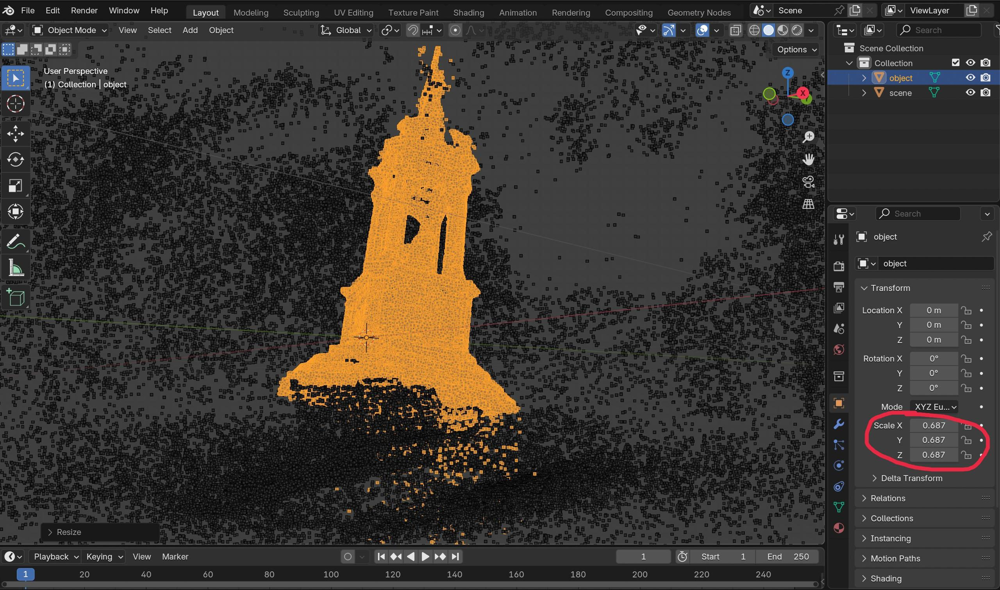
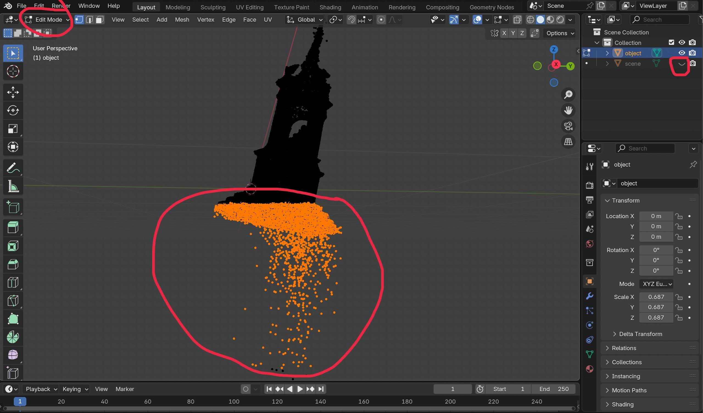

# Custom Dataset Processing

We assume you already have `sparse_pc.ply`, `transforms.json`, and an `images` folder for both the object and the scene.

## Prepare the Scene

Train a Splatfacto model:

```bash
ns-train splatfacto \
    --data /path/to/scene/data/folder/ \
    --output-dir /where/to/store/the/result \
    --viewer.quit-on-train-completion True
```

## Prepare Object

1. Load the scene and object point clouds into Blender.
2. Rescale the object to the desired size and note the scaling factor.



3. Hide the scene, then remove all background points unrelated to the object. To do this, go to **Edit Mode**, select the points, and delete them.



4. Save the processed sparse point cloud and use it for training. Also run the following script to update `transforms.json`:

```bash
python3 d3dr/custom_dataset/update_transforms_after_downscale.py \
    --data_folder /path/to/data/folder \
    --poses_scale scale_number
```

5. If your object images do not have a black background, it is better to remove it. We recommend using SAM for this purpose. Download the SAM2 checkpoint (tested with `sam2.1_hiera_small.pt`) and place it in `./checkpoints`.

6. Clone the repository into the project root:
    ```bash
    git clone https://github.com/facebookresearch/sam2.git
    ```

7. Find a few object point coordinates (3–5 points) in the first frame, then run:

    ```bash
    python3 d3dr/custom_dataset/run_sam2_video.py \
        --frames_dir /path/to/object/images/ \
        --output_folder /where/to/store/masks \
        --click_x x-coordinates \
        --click_y y-coordinates
    ```

8. Apply the masks to the images:
    ```bash
    python3 d3dr/custom_dataset/apply_masks.py \
        --images_dir /path/to/object/images/ \
        --masks_dir /where/masks/are/stored/ \
        --output_folder /where/to/store/the/results
    ```

9. Place the masked images, camera poses (`transforms.json`), and processed point cloud into a single folder, then train a Splatfacto model:

    ```bash
    ns-train splatfacto \
        --data /path/to/object/data/folder/ \
        --output-dir /where/to/store/the/result \
        --pipeline.model.background-color black \
        --viewer.quit-on-train-completion True
    ```

## Find the Transformation

1. Extract a point cloud from the trained object Splatfacto model:
    
    ```bash
    python3 d3dr/custom_dataset/pc_from_splat.py \
        --ckpt_path /path/to/object/ckpt/ \
        --output_file /path/where/to/store/object/ply
    ```

2. Load the two point clouds into Blender, align the object, and record the Rotation (Euler angles) and Location (translation).


## Create a new scene folder

Create a scene folder with the structure descrined in the [README.md](../README.md#dataset).
Update transforms.json with new fields "euler_rotation" (rotation in radians) and "object_center" (location).

